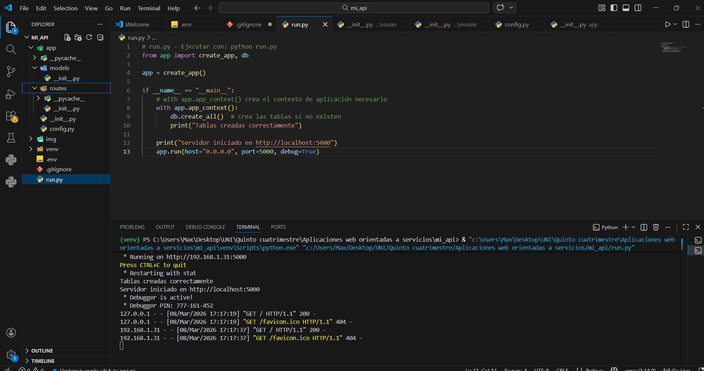
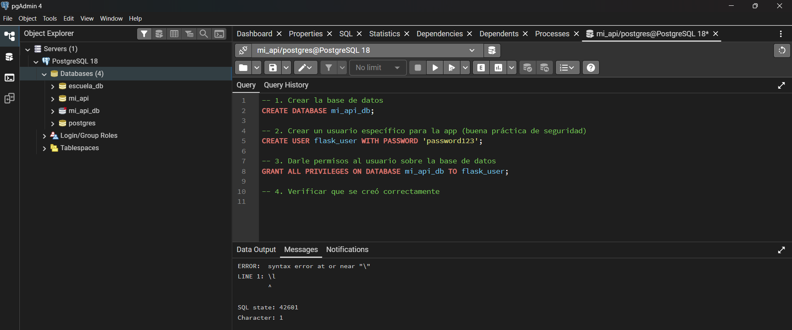
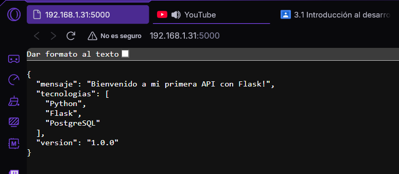

## Ejercicio 1 - Configuración del Entorno

En este ejercicio se realizó la configuración inicial del entorno de desarrollo para crear una API utilizando Python con Flask y una base de datos PostgreSQL. Primero se creó la estructura del proyecto separando los diferentes componentes de la aplicación, como la configuración, los modelos y las rutas. Esta organización permite mantener el código ordenado y facilita su mantenimiento y escalabilidad.

Posteriormente se configuró la conexión a la base de datos PostgreSQL mediante variables de entorno utilizando un archivo `.env`, lo que permite mantener la información sensible fuera del código fuente. También se configuró SQLAlchemy como ORM para gestionar la comunicación entre la aplicación y la base de datos.

Una vez configurado el entorno, se creó una ruta básica en la API para verificar que el servidor funciona correctamente. Finalmente se ejecutó la aplicación y se comprobó su funcionamiento accediendo a la ruta principal desde el navegador.

### Evidencias del ejercicio

**Estructura y ejecución del proyecto en Visual Studio Code**

**Base de datos creada en PostgreSQL (pgAdmin)**

**Resultado de la API ejecutándose en el navegador**

